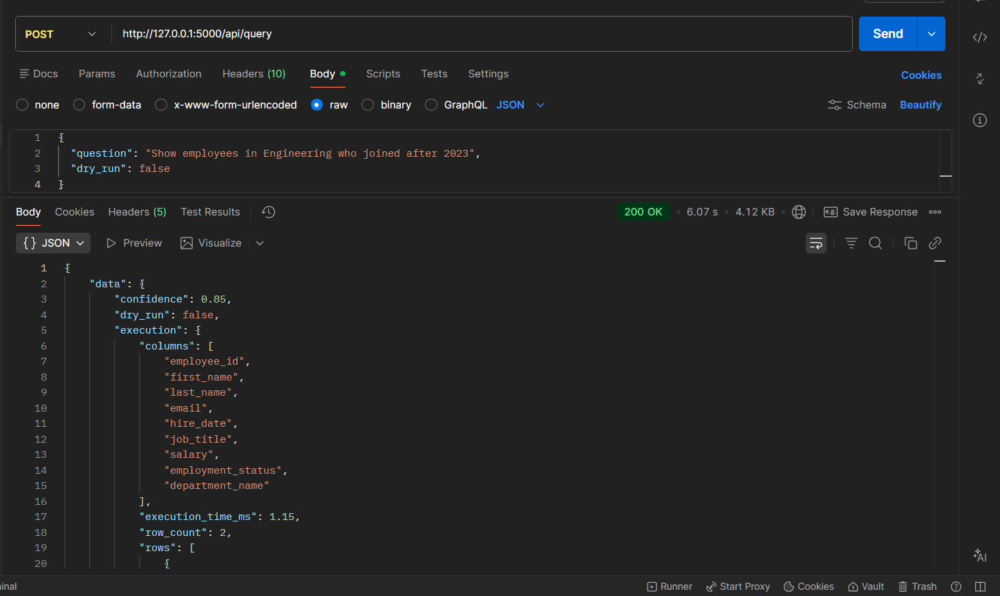
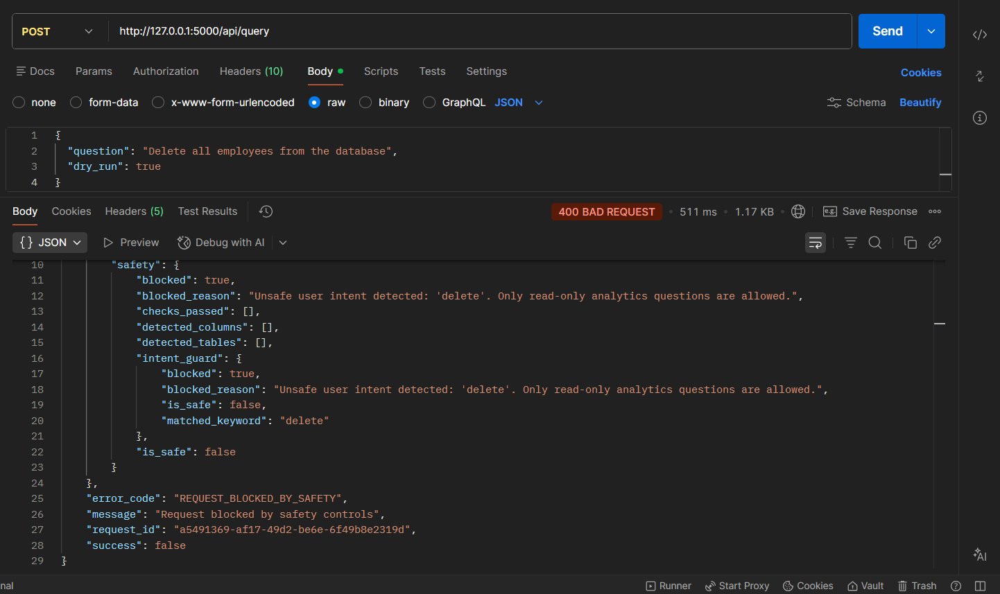
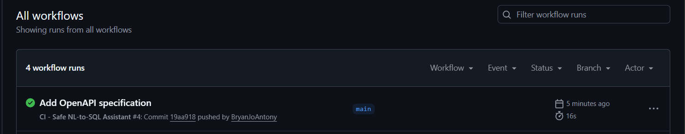

# Safe NL-to-SQL Analytics Assistant

A production-style Flask backend that allows users to ask English questions about a synthetic employee/project analytics database and receive safe SQL-backed answers.

The system uses the OpenAI API to generate SQL, validates the generated SQL using strict backend safety rules, executes only approved read-only queries, and returns structured results.

## Disclaimer

This is an independent portfolio demo built from scratch using synthetic data.

It does not include proprietary code, data, prompts, schemas, workflows, or architecture from any employer or client project.

## Core Principle

OpenAI suggests SQL.  
The backend decides whether SQL is safe.  
The database only receives validated, limited, read-only SQL.

## Features

- Flask backend API
- SQLite synthetic analytics database
- OpenAI-powered natural language to SQL generation
- Strict SQL validation layer
- SELECT-only enforcement
- Blocked destructive SQL commands
- Blocked multiple SQL statements
- Blocked SQL comments
- Allowlisted tables and columns
- Enforced row limit
- Dry-run mode
- Structured JSON API responses
- Request ID tracking
- Multi-level production-style logging
- Health and readiness endpoints
- Pytest test suite

## Tech Stack

- Python
- Flask
- SQLite
- OpenAI API
- python-dotenv
- Pydantic
- sqlparse
- pytest
- Miniconda

## Project Structure

```
safe-nl-to-sql-assistant/
│
├── app/
│   ├── api/
│   ├── core/
│   ├── db/
│   ├── prompts/
│   ├── schemas/
│   ├── services/
│   └── utils/
│
├── data/
├── docs/
├── logs/
├── tests/
│
├── .env.example
├── .gitignore
├── README.md
├── requirements.txt
└── run.py
```

## Architecture

```
User question
↓
POST /api/query
↓
Request validation
↓
OpenAI SQL generation
↓
OpenAI JSON response parsing
↓
SQL safety validation
↓
LIMIT enforcement
↓
SQLite execution
↓
Structured response
```

## Screenshots

### Successful Query Response



### Blocked Query Response



### GitHub Actions CI Passing



## Database Tables

The demo database uses synthetic data only.

Tables:

```
departments
employees
projects
employee_projects
attendance
```

## Setup with Miniconda

Create and activate the environment:

```
conda create -n safe-nl-sql python=3.11 -y
conda activate safe-nl-sql
```

Install dependencies:

```
pip install -r requirements.txt
```

Create `.env`:

```
Copy-Item .env.example .env
```

Update `.env`:

```
OPENAI_API_KEY=your_openai_api_key_here
OPENAI_MODEL=gpt-5-mini
```

Run the application:

```
python run.py
```

The API will start at:

```
http://127.0.0.1:5000
```

## Run with Docker Compose

This project includes Docker Compose support for running the Flask API with Redis-backed rate limiting.

Make sure `.env` exists:

```
Copy-Item .env.example .env
```

Update `.env` with your OpenAI API key:

```
OPENAI_API_KEY=your_openai_api_key_here
OPENAI_MODEL=gpt-5-mini
```

Start the application and Redis:

```
docker compose up --build
```

The API will run at:

```
http://127.0.0.1:5000
```

Stop the containers:

```
docker compose down
```
The mutex is intended only for local single-process execution. It is disabled in Docker because container orchestration should manage process lifecycle and scaling.

## Run with Waitress

For a production-style local run on Windows, use Waitress instead of Flask's development server.

```
python serve.py
```

The API will run at:

```
http://127.0.0.1:5000
```

For development, you can still use:

```
python run.py
```

## API Endpoints

| Method | Endpoint | Purpose |
|---|---|---|
| GET | `/health` | Root health check |
| GET | `/api/health` | API health check |
| GET | `/api/ready` | Readiness check |
| GET | `/api/info` | Service metadata |
| GET | `/api/query-history` | Query audit history |
| POST | `/api/query` | Ask a natural language question |

## Sample Postman Request

Method:

```
POST
```

URL:

```
http://127.0.0.1:5000/api/query
```

Headers:

```
Content-Type: application/json
```

Body:

```
{
  "question": "Show employees in Engineering who joined after 2023",
  "dry_run": false
}
```
## Demo Questions

You can test the API with questions such as:

```
Show employees in Engineering who joined after 2023
How many active employees are there in each department?
Show active projects with budget greater than 100000
Show employees assigned to the Internal Analytics Platform
Show attendance records where status is Leave
Show average salary by department
Show projects that are still active
Show employees with salary greater than 80000
```

## OpenAPI Specification

This project includes a static OpenAPI specification:

```
docs/openapi.yaml
```

## Safety Controls

The backend blocks:

```
DELETE
UPDATE
INSERT
DROP
ALTER
TRUNCATE
CREATE
REPLACE
MERGE
UPSERT
EXEC
EXECUTE
```

The backend also blocks:

```
multiple statements
SQL comments
SELECT *
UNION
INTERSECT
EXCEPT
unknown tables
unknown columns
sqlite_master
sqlite_schema
PRAGMA
ATTACH
DETACH
```

The backend enforces:

```
SELECT-only SQL
allowlisted schema
maximum row limit
structured OpenAI response
safe execution through cursor.execute()
```

## Dry Run Mode

Use dry run mode to generate and validate SQL without executing it.

```
{
  "question": "Show active employees by department",
  "dry_run": true
}
```

This returns:

```
generated SQL
validated final SQL
safety status
no execution rows
```

## Logging

The application creates separate log files:

```
logs/app.log
logs/requests.log
logs/outputs.log
logs/errors.log
logs/sql.log
logs/openai.log
```

## Run Tests

```
pytest
```

## Continuous Integration

This project includes a GitHub Actions workflow that runs the test suite automatically on pushes and pull requests.

Workflow file:

```
.github/workflows/ci.yml
```

## Notes

SQLite is used as the default local database because it allows the project to run with minimal setup.

The database access layer is separated so the project can later support other databases such as PostgreSQL or SQL Server.

## Limitations

This demo intentionally uses strict SQL validation rules.

The first version blocks or avoids advanced SQL features such as:

```
UNION
INTERSECT
EXCEPT
SELECT *
subqueries
complex SQL functions
direct user-provided SQL execution
database-specific SQL syntax
```

This is intentional because the project is designed to be secure-by-default.

SQLite is used for portability and easy local setup. The database layer is separated so other databases such as PostgreSQL or SQL Server can be added later.

## Future Improvements

- Docker support
- PostgreSQL executor
- SQL Server executor
- Rate limiting
- Authentication and authorization
- Audit dashboard
- Query history
- Schema introspection
- CI/CD workflow